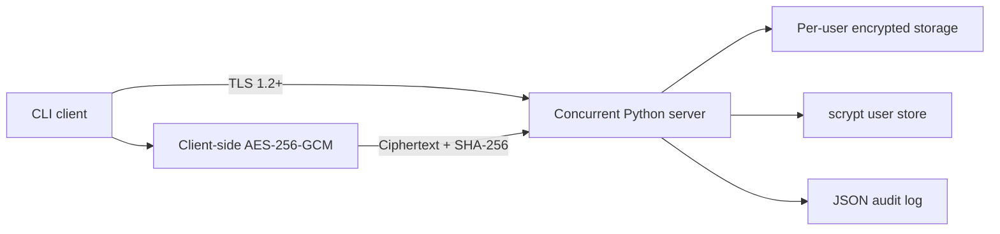

# Secure File Transfer System v2

A security-focused Python client/server application that encrypts files on the client, authenticates users over TLS, verifies every transfer, and stores only authenticated ciphertext on the server.

This began as a CYSE 250 socket-programming assignment and was rebuilt as a production-oriented learning project. It is designed to demonstrate security engineering decisions—not to claim that a classroom project has received a professional security audit.

## Why this version is different

The original prototype proved that a client could register, log in, and upload a file. Version 2 replaces the fixed XOR key, raw SHA-256 password records, newline-delimited messages, blocking server loop, and duplicated code with stronger, testable controls.



## Security and engineering highlights

| Control | Implementation |
|---|---|
| File confidentiality and integrity | Streaming AES-256-GCM with a fresh 96-bit nonce and 128-bit salt per file |
| Client-side key ownership | File passphrases never leave the client; the server stores only `.sft` ciphertext envelopes |
| Password storage | Per-user salted scrypt records with constant-time verification and legacy hash migration |
| Transport protection | TLS 1.2+ with hostname and certificate verification enabled by default |
| Transfer integrity | SHA-256 is calculated while streaming; mismatches discard the temporary file |
| Safe wire protocol | Versioned, length-prefixed JSON control frames with strict message and file-size limits |
| Authorization boundary | Files are isolated under an authenticated user's storage namespace |
| Path safety | Traversal is rejected and filenames are constrained before any filesystem operation |
| Availability controls | Thread-pool concurrency, socket timeouts, upload reservations, and a 100 MiB limit |
| Brute-force resistance | Per-account/IP sliding-window login throttling with a temporary lockout |
| Auditability | Structured JSON events record logins and transfers without passwords or passphrases |
| Failure safety | Atomic writes, restrictive file permissions, authenticated decryption, and cleanup of partial files |

## Capabilities

- Register a user with an enforced 12-character minimum password.
- Upload any file after client-side authenticated encryption.
- List only the encrypted files owned by the authenticated user.
- Download, verify, and decrypt a file locally.
- Detect a wrong file passphrase, modified ciphertext, truncated transfer, or mismatched transfer digest.
- Serve multiple TLS clients concurrently.
- Generate local development certificates with the included helper.

## Project structure

```text
server.py          TLS server, authorization, concurrency, rate limiting, audit events
client.py          CLI registration, upload, list, download, and local decryption
protocol.py        Length-prefixed JSON framing and verified streaming transfers
crypto_utils.py    Streaming AES-256-GCM envelope format
auth.py            scrypt credentials, atomic user storage, and login throttling
file_utils.py      Filename validation and per-user storage paths
generate_certs.py  Local CA and server-certificate generator
test_secure_transfer.py  Authentication, crypto, protocol, tamper, and TLS tests
```

## Quick start

Requires Python 3.11 or newer.

```bash
python3 -m venv .venv
source .venv/bin/activate
python -m pip install -r requirements.txt
python generate_certs.py
```

Start the TLS server:

```bash
python server.py
```

In another terminal, register and upload a file:

```bash
python client.py register analyst
python client.py upload analyst sample.txt
python client.py list analyst
```

Download and decrypt it:

```bash
python client.py download analyst sample.txt --output recovered-sample.txt
```

Account passwords and file-encryption passphrases are requested with `getpass`, so they do not appear in shell history or command-line process listings.

## Run the security tests

```bash
python -m unittest -v test_secure_transfer.py
```

The suite covers scrypt credential storage, rate limiting, binary encryption round trips, wrong-passphrase rejection, ciphertext tamper detection, length-prefixed framing, failed transfer cleanup, and path traversal rejection.

## Threat model and limitations

- The design protects file contents from passive network observers and from a storage server that does not know the file passphrase.
- TLS still protects usernames, account passwords, filenames, sizes, and protocol metadata in transit.
- The server can delete or deny access to ciphertext; this project does not provide Byzantine storage guarantees.
- The local certificate generator is for development. A deployed service should use managed PKI, protected private keys, centralized secrets, durable rate limiting, and external identity controls.
- The JSON user store is deliberately understandable for a portfolio project. A multi-instance deployment should use a transactional identity database.
- This implementation has automated security-focused tests but has not undergone an independent penetration test or cryptographic audit.

## Recruiter-facing engineering decisions

The most important part of this project is not the number of features; it is the boundary design:

1. Encryption happens before upload, so the server does not need the file key.
2. AES-GCM authenticates both ciphertext and envelope metadata, so tampering fails closed.
3. TLS protects credentials and metadata even though file contents are already encrypted.
4. The protocol separates control frames from file bytes and enforces explicit limits.
5. Atomic writes and digest verification prevent incomplete uploads from becoming valid stored objects.
6. Tests exercise failure paths—including tampering and traversal—not only the happy path.
